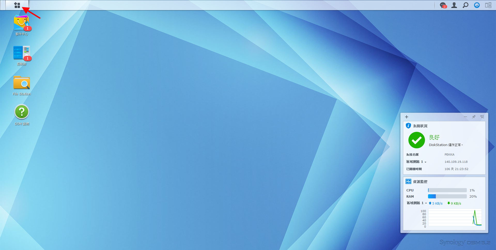
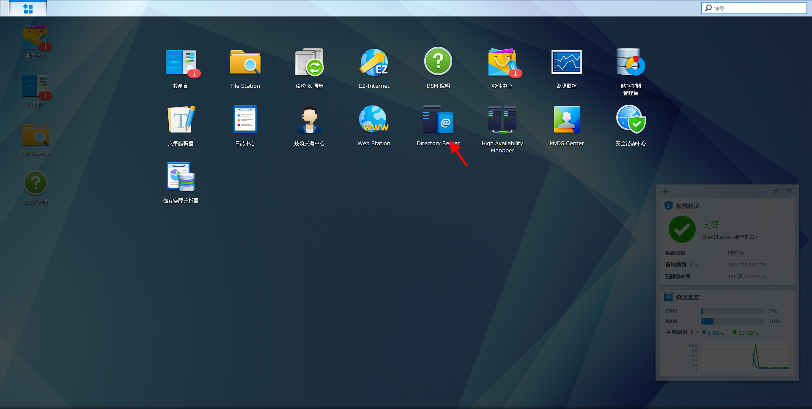
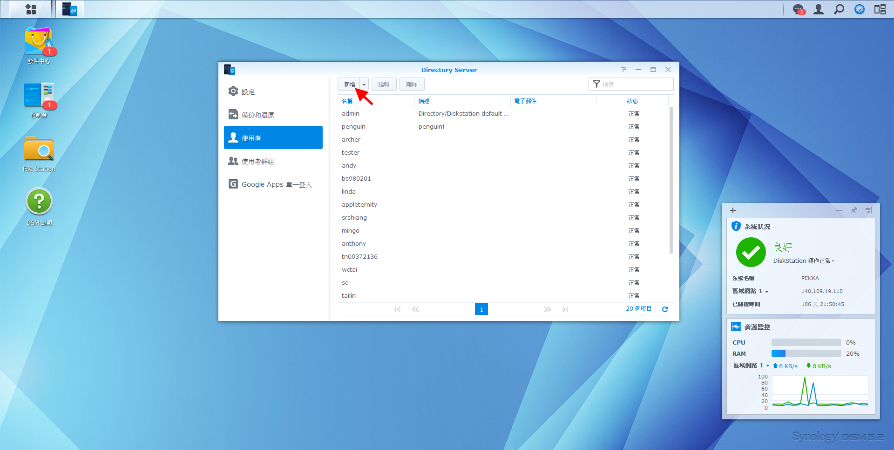
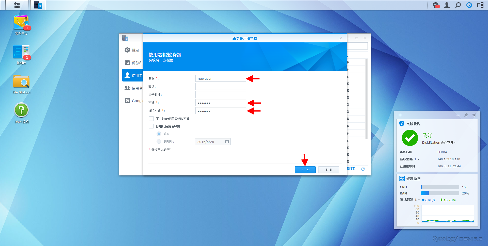
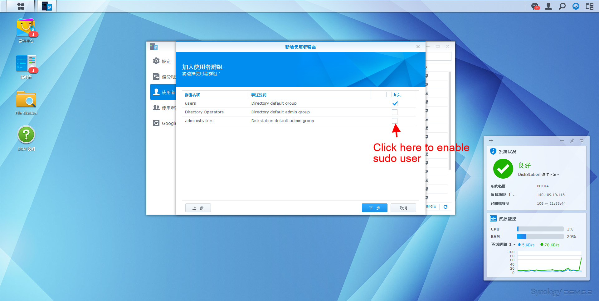

#Server system
Ubuntu 12&14

# NFS
[Reference](https://www.digitalocean.com/community/tutorials/how-to-set-up-an-nfs-mount-on-ubuntu-12-04)

1. Install NFS
```bash
$ sudo apt-get install nfs-common portmap
```
2. configure
```bash
$ mkdir /corpus /tools
$ vim /etc/fstab and add the following lines:
# mount /corpus from PEKKA
pekka.iis.sinica.edu.tw:/volume1/corpus     /corpus         nfs     defaults,auto   0    0
# mount /home from PEKKA
pekka.iis.sinica.edu.tw:/volume1/tempHome       /home        nfs     defaults,auto   0    0
# mount /tools from PEKKA
pekka.iis.sinica.edu.tw:/volume1/tools      /tools          nfs     defaults,auto   0    0
$ mount -a
```

#LDAP
[Reference](https://www.digitalocean.com/community/tutorials/how-to-authenticate-client-computers-using-ldap-on-an-ubuntu-12-04-vps)
1. Install LDAP client
```bash
$ sudo apt-get install libpam-ldap nscd
ldap://LDAP-server-IP-Address
base dn: dc=pekka,dc=iis,dc=sinica,dc=edu,dc=tw
LDAP version to use: 3
Make local root Database admin: Yes
Does the LDAP database require login? No
LDAP account for root: uid=root,cn=users,dc=pekka,dc=iis,dc=sinica,dc=edu,dc=tw
password: please_ask_administrator
$ sudo dpkg-reconfigure ldap-auth-config
```
2.  Setting authentication files
```bash
$ vim /etc/nsswitch.conf
passwd:         files ldap
group:          files ldap
shadow:         files ldap
$ vim /etc/pam.d/common-session (PAM configuration)
session required    pam_mkhomedir.so skel=/etc/skel umask=0022
```

3. Restart service
```bash
$ sudo /etc/init.d/nscd restart
$ vim /etc/sudoers (Permission configuration)
 %administrators ALL=(ALL) ALL
```

4. Integration with ZSH
```bash
$ vim /etc/ldap.conf
nss_override_attribute_value loginShell /usr/bin/zsh
```

5. Setting up User's home directory template
```bash
$ mkdir /home/TEMPLATE
# Add some configure file such as .zshrc in /home/TEMPLATE
$ cd /etc/pamd.d/
$ vim common-session
# Ceate a home directory if not exists
session required    pam_mkhomedir.so skel=/home/TEMPLATE umask=0022
$ vim sshd
# Ceate a home directory if not exists
session required    pam_mkhomedir.so skel=/home/TEMPLATE umask=0022
```

6. Integration with XRDP
```bash
# install xrdp
$ sudo apt-get install xrdp
# modify login pam
$ vim /etc/pam.d/sesman
#%PAM-1.0
@include common-auth
@include common-account
@include common-session
@include common-password
# install RAVEfinity (optional, modifying the UI)
$ sudo add-apt-repository ppa:ravefinity-project/ppa
$ sudo apt-get update
$ sudo apt-get install ambiance-flat-colors radiance-flat-colors
```

# OpenSSL
read NOTE.UNIX in openssl folder

# Add Account
1. login pekka (http://pekka.iis.sinica.edu.tw:5000/webman/index.cgi )







# Web Service (nginx)
1. directory: doraemon -> /etc/nginx/sites-enabled
2. need root or sudoer to change the configure file and restart the nigix service
3. restart command
   $ service nginx restart

